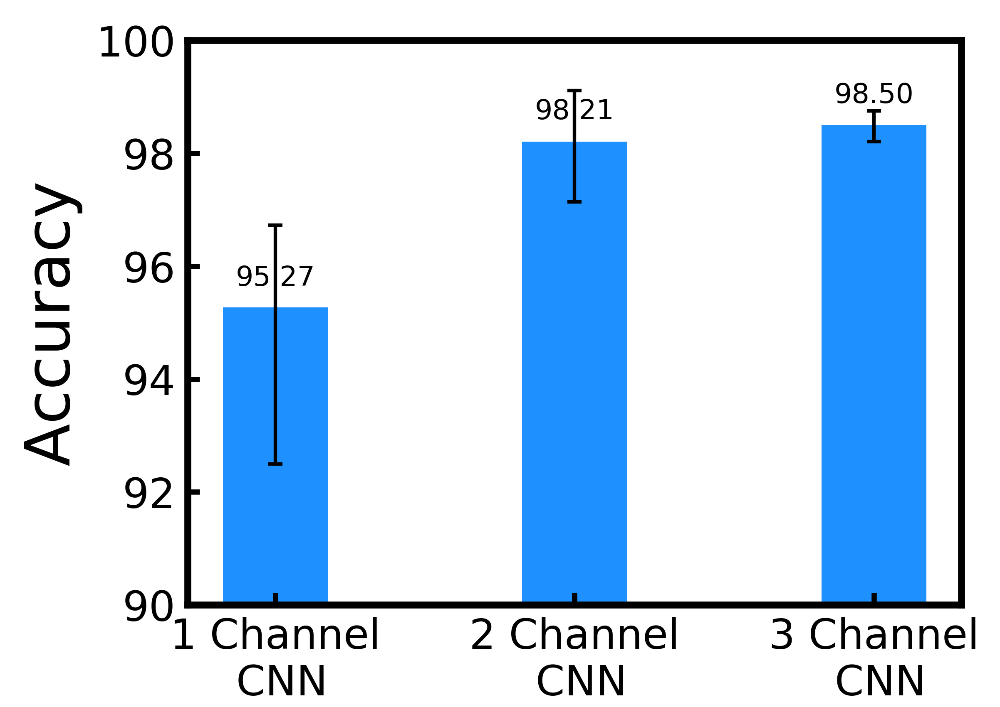

# About the project
This is the repository of FaultNet: A CNN for bearing fault detection and classification.
The increased presence of advanced sensors on the production floors has led to the collection of datasets that can provide significant insights into machine health. An important and reliable indicator of machine health, vibration signal data can provide us a greater understanding of different faults occurring in mechanical systems. In this  work,  we analyze vibration signal data of mechanical systems with bearings by combining different signal processing techniques and coupling  them with machine  learning  techniques to  classify different  types  of  bearing  faults. We  also  highlight the  importance  of  using  different  signal processing methods and analyze their effect on accuracy for bearing fault detection. Apart from the traditional machine learning  algorithms  we  also  propose  a  convolutional  neural  network  FaultNet  which  can  effectively determine the type of bearing fault with a high degree of accuracy. The distinguishing factor of this work is the idea of channels proposed to extract more information from the signal, we have stacked the ‘Mean’ and ‘Median’ channels to raw signal to extract more useful features to classify the signals with greater accuracy.

# Datasets
There are two datasets that have been used. 
1. Case Westerm Reserve University Bearing Dataset (CWRU)
2. Paderborn University Dataset

# CNN Architecture

# Results

To download the featurized data directly and for more information, visit our website, [manufacturingnet.io.](http://manufacturingnet.io/)
Please cite CWRU and Paderborn University if you use the raw data

The preprint is available here: https://arxiv.org/abs/2010.02146
